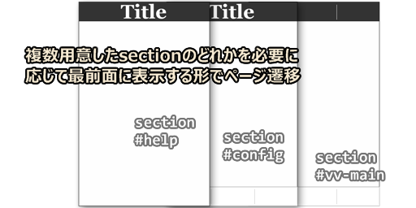
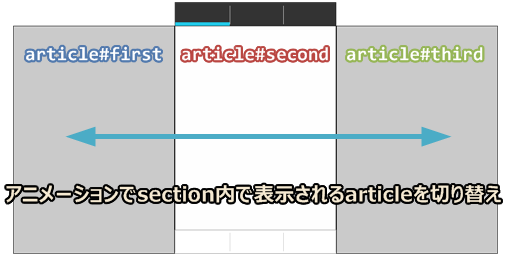
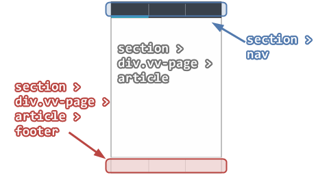
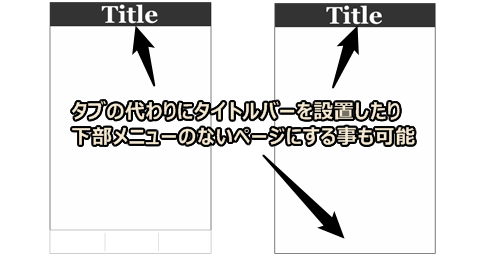
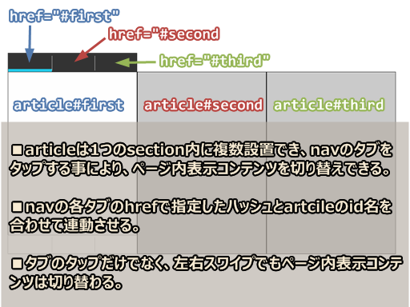
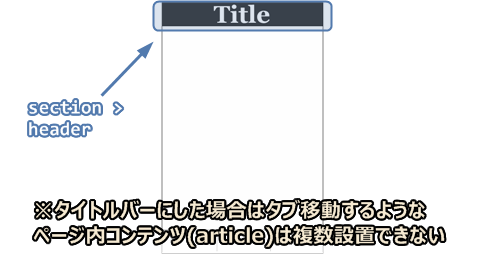
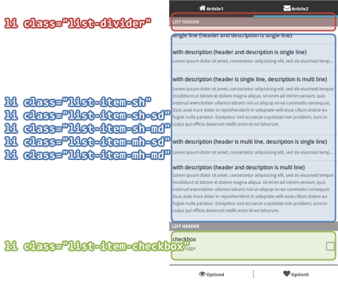
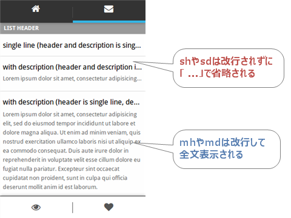
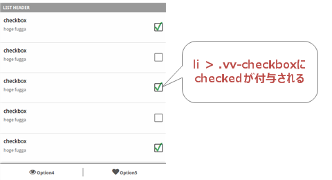

# ViVi - HTML5 Mobile Application Framework -

ViViはPhoneGapなどのHTMLを使用するモバイルアプリ用のフレームワークです。

モバイルアプリ用フレームワークと言えば[jQuery Mobile](http://jquerymobile.com/)や[Sencha Touch](http://www.sencha.com/products/touch/)などがありますが、これらの大規模フレームワークは色々揃っていて便利な反面、端末のスペックによってはもっさり動作になることが多い事と、学習コストもそれなりに必要というデメリットがあります。

ViViは、そういった大規模フレームワークとは真逆の方向へ向かっているフレームワークです。学習コストが少なく(このREADME.mdですべて説明できる程度)、非常に軽快に動作するのが特徴です。

## 特徴

nav, header, section, article, footerなどのタグを決められたルールに従い記述すれば、JavaScriptで初期化コードを1行書くだけでアプリのUI部分の動きを(ほぼ)完成させる事ができます。

タブのタップや左右スワイプでページ内コンテンツを切り替えたり、別のページを呼び出したり、タッチ時のハイライト、長いコンテンツ内の上下スワイプによる慣性スクロールなどを全てフレームワーク側で実装してくれるので、開発者はコンテンツ部分の作成だけに集中する事ができます。

依存ライブラリは[Hammer.js](http://eightmedia.github.io/hammer.js/)だけなので、サイズ的にもモバイル向けとなっています。気になるパフォーマンスですが、数年前のタブレット(Android 2.2)でも特にストレスなく動作するレベルになっています。

## DEMO

デモページを[こちら](http://ktty1220.me/vivi/example.html)に用意しています(デスクトップ用のブラウザでも操作可能です)。

## 残念な所

セールスポイントだけアピールしても胡散臭いので、現状のイケてない所も紹介しておきます。

### 慣性スクロールは気持ち程度

当初は有名ライブラリである[iScroll](https://github.com/cubiq/iscroll)を組み込んで開発していましたが、スペックの良くない端末ではガクガクになってしまう場合が多かったため、自前でスクロール機能を実装しています。

ストレスのない軽快な動作を重視しているので、一応慣性スクロールはしますがiScrollほどの滑らかさはありません。ただ、滑らかさを重視した結果、負荷がかかってガクガクになってしまうような本末転倒は避けることができていると思います。

### UIがAndroid臭い

ViViはAndroidアプリ作成中に生まれたフレームワークなのでUIもAndroidっぽくなっています。将来的にはiOSっぽいテーマ、Firefox OSっぽいテーマなど増やしていければと考えていますが、現状はこのAndroid風UIのみとなっています。

### 一度にアプリで使用する全てのページをロードするので大規模アプリには向かない

ViViは、index.htmlに全てのコンテンツを詰め込むスタイル(ページ遷移をしない)なので、何10ページもあるようなアプリではメモリや最初のロード時間に問題が発生するかもしれません。逆に言えば数ページの軽量アプリなら最初に全部ロードしてしまうので、その後のレスポンスは非常に軽快になるという事でもあります。

また、Ajaxなどで表示データを書き換える設計ならば、数ページでも実質大量のコンテンツを表示できる事になります。

### UI部品がほとんどない

ViViはレイアウト周りの面倒を見てくれるフレームワークなのでボタンやフォーム部品などは用意していません。用意されているページ内パーツはリストとチェックボックスのみです。アイコンもViVi専用というものはありません。各自で[FontAwesome](http://fortawesome.github.io/Font-Awesome/)や[fontello](http://fontello.com/)などからお好みに合わせて自由に使ってくださいというスタイルです。

## 使い方

htmlでvivi.cssとvivi.jsをロードします。

    <link rel="stylesheet" href="/path/to/vivi.css">
    

あとはHTMLを決められたルールに従って記述してJavaScriptで初期化コードを1行書くだけです。初期化コードは以下のように書きます。

    VV.ready(function () {
      // アプリ内の挙動などのコード
    });

jQueryの`ready()`と同じようなものと思ってもらって良いと思います。

`VV`という変数はスクリプトロード時に自動的に作成されるViViを操作する変数です。

## HTML記述ルール

ViViでは、1つのhtmlファイル内にアプリで使用されるすべてのページを事前に記述します。リンクをクリックして別htmlをロードするという形ではありません。

以下で紹介するタグを組み合わせてアプリ内の各ページを設計していきます。

### ページ構成要素タグ

#### section

ViViの基本となるタグです。

sectionは画面1ページ全体専用のタグとなっています。複数のsectionを用意することによりアプリ内でページ遷移する事ができます(ページの切り替え時にはスライドアニメーションが発生します)。

sectionで必須なルールは以下のとおりです。

* すべてのsectionに`id="..."`というid指定が必要になります。
* アプリ起動時にデフォルトで表示させるsectionのidは`vv-main`という名称でなければなりません(上図で言うと一番下に隠れているsectionが起動時に表示されていたもの)。
* sectionの直子には`class="vv-page"`というdiv要素が必要です。その`vv-page`内にページ内のコンテンツであるarticleを1つまたは複数設置する形になります。articleについては後述します。

上記のルールに従うと、最もシンプルな形のページはこのようになります。

    <body>
      <section id="vv-main">
        

          <article>
            <!-- ここからページ内のコンテンツを記述 -->
            <h1>たいとる</h1>
            ...
          </article>
        

      </section>
    </body>

上図のように複数のページをもつアプリの場合はこのようになります。

    <body>
      <!-- デフォルトで表示されるページ -->
      <section id="vv-main">
        

          <article>
            <!-- ここからページ内のコンテンツを記述 -->
            <h1>たいとる</h1>
            ...
          </article>
        

      </section>

      <!-- ID:configページ -->
      <section id="config">
        

          <article>
            <!-- ここからページ内のコンテンツを記述 -->
            <h1>設定</h1>
            ...
          </article>
        

      </section>

      <!-- ID:helpページ -->
      <section id="config">
        

          <article>
            <!-- ここからページ内のコンテンツを記述 -->
            <h1>ヘルプ</h1>
            ...
          </article>
        

      </section>
    </body>

各ページはViVi APIの`changeSection()`を使用して切り替えます。ViVi APIについては後述します。

### article

articleは`section > .vv-page`内に設置するコンテンツを記述するためのタグです。

articleは1ページ内に最大5つまで設置することができます。それぞれのarticleはsectionで設置したnav内のリンク(後述)をタップすることにより自動的にスライドアニメーションで切り替わります。

また、ページ内を左右スワイプすることによっても同様の動作を行います。

articleで必須なルールは以下のとおりです。

* 最低1つは必要です(最大5つ)。
* 1ページ内のarticleが1つの場合はidは必要ありませんが、複数のarticleをタブで切り替える形の場合は各articleにidを指定する必要があります。

なお、articleはViVi初期化時に動的に`div class="article-contents"`という要素が埋め込まれ、実際のコンテンツはその中に入ります。

### 付属パーツタグ

sectionやarticleに設置するオプション的なタグです。これらのパーツを設置すると、よりアプリらしいビジュアル・動きを実装することができます。

#### nav

ページ上部にタブを設置して、タブ項目をタップすることによりページ内のarticleを切り替える事ができます。section毎に設置できます。

navのルールは以下のとおりです。

* sectionの直子に設置する必要があります。
* nav内には`ul > li > a`という形でタブ項目を設置します。
* 各aタグのhrefに連動するarticleのidをハッシュとして指定します。

簡単なnav設置例です。

    <section id="vv-main">
      <!-- nav -->
      <nav>
        <ul>
          <li><a href="#article1">Article1</a></li>
          <li><a href="#article2">Article2</a></li>
        </ul>
      </nav>
    
      <!-- vv-page -->
      

    
        <!-- article1 -->
        <article id="article1">
          <h1>あーてぃくる1</h1>
        </article>
    
        <!-- article1 -->
        <article id="article2">
          <h1>あーてぃくる2</h1>
        </article>
    
      

    </section>

nav内の1つ目のタブのhrefが`#article1`なので、section内に設置してある`<article id="article1"`のコンテンツと紐付けられています。2つ目のタブは`#article2`で連動しています。

したがって、`#article2`のタブをタップするとコンテンツが`<article id="article2"`の内容にスライドアニメーションで切り替わり、`#article1`のタブをタップすると戻ってくる形になります。

#### header

ページ内コンテンツが1つでいい場合はnavのようなタブは必要ありません。替わりにheader要素でタイトルバーを設置することができます。

headerのルールは以下のとおりです。

* sectionの直子に設置する必要があります。
* header内に`class="vv-back"`というaタグを設置した場合、そのリンクをタップすると自動的に現在のsectionを閉じることができます。
* デフォルトページの`<section id="vv-main"`のheaderに`vv-back`リンクを設置した場合、`vv-back`をタップするとアプリを終了します。

headerサンプルです。

    <section id="hoge">

      <!-- header -->
      <header>
        <a href="#" class="vv-back">戻る</a>
        <h1>へっだーたいとる</h1>
      </header>

      <!-- vv-page -->
      

        <!-- article -->
        <article>
          ...
        </article>

      

    </section>

#### footer

navはページ上部に表示されるarticle切り替え用のタブでしたが、footerはページ下部に常時表示されるメニューボタンを設置するコンテナのような役割を持ちます。

また、navはsection単位で設置する形ですが、footerはarticle毎にそれぞれ設定できるので、下部メニューのあるarticleとないarticleを1ページ内に混在させることができます。

footerのルールは以下のとおりです。

* articleの直子に設置する必要があります。
* footer内には`ul > li > a`という形でメニュー項目を設置します。
* navと異なり、何かと連動するわけではないのでfooterの各ボタンが押された時の処理は開発者が実装する必要があります。

footerサンプルです。

    <section id="fuga">
      <!-- nav -->
      <nav>
        <ul>
          <li><a href="#article1">Article1</a></li>
          <li><a href="#article2">Article2</a></li>
        </ul>
      </nav>
    
      <!-- vv-page -->
      

    
        <!-- article1 -->
        <article id="article1">
          <h1>あーてぃくる1</h1>

          <!-- footer -->
          <footer>
            <ul>
              <li><a href="#">Option1</a></li>
              <li><a href="#">Option2</a></li>
              <li><a href="#">Option3</a></li>
            </ul>
          </footer>

        </article>
    
        <!-- article1 -->
        <article id="article2">
          <h1>あーてぃくる2</h1>

          <!-- こちらはfooterなし -->
        </article>
    
      

    

### リストタグ

article内コンテンツは基本的には何でも自由に設置できますが、アプリらしい見た目にするためにViViではリストをサポートしています。ここではリストの設置方法を説明します。

#### ul class="list"

article内に`ul class="list"`を設置し、その中に特定のクラス名を持ったliタグを設置します。

各クラスについては以下の通りです。

##### li class="list-divider"

リスト内を区切るヘッダー部分になります。

    <article>
      <ul class="list">
        <li class="list-divider">へっだー</li>
      </ul>
                    .
                    .
                    .
    </article>

##### li class="list-item-Xh-Xd"

見出しと説明がセットになった項目です。`X`の部分は`s`もしくは`m`が入ります。

* `s`はSingleLineの`s`で、画面が狭い場合に改行せずに「...」 で省略する表示となります。
* `m`はMultiLineの`m`で、画面が狭い場合は改行して全文を表示します。

`X`の後の`h`と`d`はそれぞれHeaderとDescriptionの略で、見出し部分の太字が`h`、見出しの下の薄い色の説明文が`d`となります。

以下の組み合わせをサポートしています。例外として見出しのみの`sh`というタイプのリスト項目があります。

* list-item-sh
* list-item-sh-sd
* list-item-sh-md
* list-item-mh-sd
* list-item-mh-md

リスト項目内は見出しをh3タグ、説明文をpタグで記述します。

なお、リスト項目はデフォルトの設定ではタップされるとハイライトします。ハイライトさせたくない場合はクラス名に`vv-no-highlight`を追加してください。

    <article>
      <ul class="list">
        <li class="list-divider">へっだー</li>

        <!-- リスト項目 -->
        <li class="list-item-sh-md">
          <h3>改行されない見出し</h3>
          
改行される説明

        </li>

        <li class="list-item-mh-sd">
          <h3>改行される見出し</h3>
          
改行されない説明

        </li>

        <li class="list-item-sh no-highlight">
          <h3>改行されない見出し(タップしてもハイライトしない)</h3>
        </li>
                    .
                    .
                    .
      </ul>
    </article>

##### li class="list-item-checkbox"

リスト項目ではチェックボックスを設置することができます。リスト項目のクラス名の`list-item-Xh-Xd`に加えて`list-item-checkbox`を追加すると自動的にチェックボックスが作成されます。

    <article>
      <ul class="list">
        <li class="list-item-mh-sd list-item-checkbox">
          <h3>チェックボックス付きのリスト項目</h3>
          
チェックボックスに関する説明

        </li>
                    .
                    .
                    .
      </ul>
    </article>

`list-item-checkbox`を持ったリスト項目内には`div class="vv-checkbox"`というタグが動的に作成され、チェックボックスがチェックされている場合はその`vv-checkbox`に`checked`クラスが追加されます。

### その他

現在用意されているUIパーツはこれだけです。AndroidのWebViewではフォーム内要素関連でのバグが多いので、基本的に使わない事を推奨しています。どうしてもユーザーからのテキスト入力などを受け付けたい場合は、特定のリスト項目をタップしたらpromptダイアログを表示させるといった形で実装は可能です。

また、諸事情によりViViのページ内に設置したaタグなどのリンクはタップしてもページ遷移はしません(リンクは無効化されています)。

基本的に1つのhtmlファイル内にすべてのページを記述する形なのでページ遷移させる必要はないのですが、リンクをタップした時に何かアクションを起こしたい場合は`addEventListener()`や後述する`VV.event`、もしくは別途jQueryを読み込んでクリック(タップ)イベントを実装するなどしてください。

## API

vivi.jsを`<script>`タグで読み込むと`VV`というグローバルオブジェクトが作成されます。この`VV`を使用して各種APIメソッドを呼び出します。

### システム関連

#### ready(callback)

ViViの初期化APIです。ViViを利用したアプリでは必ず最初に呼び出す必要があります。

`callback`ではViVi初期化後に実行するアプリのコード(各種イベント処理など)を記述します。

`callback`の外で`VV`オブジェクトを使用するような処理を書いても初期化の完了が保証されていない状態なので正常に動作しない可能性があります。

    // OK
    VV.ready(function (callback) {
      VV.event.tap( ...
    });

    // NG
    VV.ready(function (callback) {
    });
    VV.event.tap( ...

### イベント

#### event.XXX(target, handler)

ViViの内部で利用しているHammer.jsを通してタップやスワイプなどの各種イベントを登録することができます。

`target`にDOM要素やCSSセレクタを指定して、発生したイベントを`handler`で処理します。

DOM要素を指定する場合は、単一のDOM要素でもDOM要素の配列でもOKです。

    // #show-helpタップ時に実行する(CSSセレクタ指定)
    VV.event.tap('#show-help', function (ev) {
      ...
    });

    // #show-help左スワイプ時に実行する(DOM要素指定)
    VV.event.swipeleft(VV.find('#show-help'), function (ev) {
      ...
    });

`event.XXX`の`XXX`に登録できるイベントは以下の通りです。イベントハンドラに渡される情報については[Hammer.jsの公式ドキュメント](https://github.com/EightMedia/hammer.js/wiki/Getting-Started#event-data)を参照してください。

* hold
* tap
* doubletap
* drag
* dragstart
* dragend
* dragup
* dragdown
* dragleft
* dragright
* swipe
* swipeup
* swipedown
* swipeleft
* swiperight
* transform
* transformstart
* transformend
* rotate
* pinch
* pinchin
* pinchout
* touch
* release

#### fireEvent(eventName, element)

イベントをプログラムサイドから発火させます。

`eventName`は上記に上げた`VV.event`がサポートしているイベント名や`addEventListener()`で登録したイベント名を指定します。

`element`にはイベントを発生させるDOM要素を指定します。省略した場合は`document`となります。

    // #show-helpのタップを擬似的に実行
    VV.fireEvent('tap', VV.find('#show-help')[0]);

### DOM操作

jQueryのような万能型ではないですが、素のJavaScriptよりはマシ程度のDOM操作APIです。

#### find(selector, from)

`from`のDOM要素配下から`selector`に該当したDOM要素の__配列__を取得します。該当するDOM要素がない場合は空配列が返ります。

`from`は省略可能です。省略した場合のデフォルトは

* `VV.find()`の場合は`document`
* `VV.section.XXX.find()`の場合はそのSectionオブジェクトに紐付けられているsectionのDOM要素(`<section id="XXX"`)

です。

`selector`の内容によって内部で呼び出すDOMメソッドが異なるので、戻り値の型はHTMLElementやNodeListだったりとバラバラですが、__どれも配列として扱える形で返ってきます。__

    // documentからclass=".hoge"のDOM要素を取得
    var hoges = VV.find('.hoge');
    console.log(hoges.length); // -> .hogeの要素数

    // 1つ目の.hoge内に存在するaタグを取得
    var aTags = VV.find('a', hoges[0]);
    console.log(aTags); // -> [ DOM要素, DOM要素, DOM要素, ... ];

    // 取得したaタグのhrefを順番にconsole.log
    for (var i = 0; i < aTags.length; i++) {
      console.log(aTags[i].getAttribute('href'));
    }

    // section#config内のチェックボックス付きのリスト項目を取得
    var checkboxes = VV.section.config.find('.list > .list-item-checkbox');

#### each(selector, from, func)

上記`find()`のサンプルで、aタグの配列を取得してforでループさせる処理がありますが、その一連の処理を一度に行うのがこの`each()`です。

`from`のDOM要素配下から`selector`に該当したDOM要素に対して`func`の関数を実行します。

`selector`および`from`に関しては`find()`と同様のルールです。`func`には(DOM要素, DOM要素配列内のインデックス)の2つを引数に持つ関数を指定します。

    // 1つ目の.hoge内に存在するaタグのhrefを順番にconsole.log
    VV.each('a', VV.find('.hoge')[0], function (el, idx) {
      console.log(el.getAttribute('href'));
    });

    // section#config内のチェックボックス付きのリスト項目を取得
    VV.section.config.each('.list > .list-item-checkbox', function (el, idx) {
      ...
    });

#### hasClass(element, className)

`element`のDOM要素に`className`クラスが付与されているかどうか判定します。戻り値は`true`、`false`のいずれかです。

    // section#config内のチェックボックス付きのリスト項目を取得
    VV.section.config.each('.list > .list-item-checkbox > .vv-checkbox', function (el, idx) {
      // チェックされているかどうか判定
      console.log(VV.hasClass(el, 'checked'));
    });

#### addClass(element, className)

`element`のDOM要素に`className`クラスを付与します。すでに`className`が付与されている場合は何もしません。

    // section#config内のチェックボックス付きのリスト項目を取得
    VV.section.config.each('.list > .list-item-checkbox > .vv-checkbox', function (el, idx) {
      // すべてチェック状態にする
      VV.addClass(el, 'checked');
    });

#### removeClass(element, className)

`element`のDOM要素から`className`クラスを外します。元々`className`が付与されていなかった場合は何もしません。

    // section#config内の3つ目のチェックボックスのみチェックを外す
    var checkbox3 = VV.section.config.find('.list > .list-item-checkbox > .vv-checkbox')[2];
    VV.removeClass(checkbox3, 'checked');

#### toggleClass(element, className)

`element`のDOM要素の`className`クラスの有無を切り替えます。

    // section#config内のチェックボックス付きのリスト項目を取得
    VV.section.config.each('.list > .list-item-checkbox > .vv-checkbox', function (el, idx) {
      // チェック状態を反転する
      VV.toggleClass(el, 'checked');
    });

### UI操作

#### changeSection(sectionId)

sectionで記述したページを切り替えて先頭に表示させます。

`sectionId`は`<section id="..."`で指定したidです。

    // #show-helpをタップしたらsection#helpページに切り替える
    VV.event.tap('#show-help', function (ev) {
      VV.changeSection('help');
    });

#### closeSection()

現在先頭に表示されているsectionページを閉じます。sectionが1つしかないアプリや現在表示されているsectionが`id="vv-main"`を指定したデフォルトページの時はアプリを終了します。

※アプリの終了とは、PhoneGapにおける`window.navigator.app.exitApp()`が実行されるという意味です。

ちなみに`closeSection()`は、端末の戻るボタンを押した時に走る`VV.cordova.onBackButton()`処理内で自動的に実行されます。

    // 現在開いているsectionページを閉じる
    VV.closeSection();

#### changeTab(tabId)

ViViでは、navとarticleの組み合わせのルールに従い、タブをタップすると自動的に表示されるページ内コンテンツが切り替わりますが、`changeTab()`を実行すると、プログラムサイドからページ内コンテンツの切り替えを行うことができます。

`tabId`は`<article id="..."`で指定したidです。

なお、このAPIは後述する`VV.section.XXX`というSectionオブジェクトから実行します。

    // section#vv-mainに設置してあるnavのhref="#article2"タブをタップした時と同様の動き
    VV.section['vv-main'].changeTab('article2');

#### hideScrollbar(resetPosition)

スクロールバーを即座に隠します。

`resetPosition`は`true`か`false`で指定します(デフォルトは`false`)。`true`を指定するとスクロールバーの位置を先頭に戻します。

#### refreshScrollbar()

スクロールバーの長さを再計算します。項目を動的に追加する等、コンテンツの高さが変更された場合に呼び出してください。

※厳密にはこの時点では再計算はされません。`refreshScrollbar()`を呼び出した後に何らかの操作でスクロールバーが表示される直前に再計算を行うように仕込みを入れておくだけです。

## プロパティ

### el

`VV.el`の場合は`document`オブジェクトが入っているだけですが、後述の`section`プロパティ内の各Sectionオブジェクトにもこの`el`プロパティは用意されています。そちらの`el`プロパティはそのsectionのDOM要素が取得できます。

    console.log(VV.el);                    // -> document
    console.log(VV.section['vv-main'].el); // -> <section id="vv-main">のDOM要素
    console.log(VV.section.config.el);     // -> <section id="config">のDOM要素

### section

`<section id="..."`で設置した各ページの管理オブジェクト(Sectionオブジェクト)が連想配列で入っています。

このSectionオブジェクトからもDOM操作APIは使用できます。`find()`などの検索起点はそれぞれの`el`プロパティになります。

また、UI操作APIの`changeTab()`はこのオブジェクトから実行します。

    console.log(VV.section); // -> {
                                     'vv-main': <section id="vv-main">のSectionオブジェクト,
                                     'config':  <section id="config">のSectionオブジェクト,
                                     'help':    <section id="help">のSectionオブジェクト
                                   }
    // documentから.hogeを検索
    VV.find('.hoge');

    // <section id="config">要素内の.hogeを検索
    VV.section.config.find('.hoge');

### cordova

ViViはPhoneGapで使用することを前提に作成されたフレームワークなので、PhoneGapのエンジンであるcordova.jsから発火されるイベントに対応しています。

cordovaプロパティは以下のイベント対応関数を持っています。これらのイベントに関数を登録すると、PhoneGapイベントに対する処理として実行されます。

    // pauseイベント発生時にログに表示する
    VV.cordova.onPause = function () {
      console.log('pause');
    });

各イベントの詳細は[公式ドキュメント](http://docs.phonegap.com/ja/3.4.0/cordova_events_events.md.html#%E3%82%A4%E3%83%99%E3%83%B3%E3%83%88)を参照してください。なお、一部のイベントはプラグインをインストールしないと発火しないものもあります。

* onPause
* onResume
* onOnline
* onOffline
* __onBackButton__
* onMenuButton
* onSearchButton
* onStartcallButton
* onEndcallButton
* onVolumeDownButton
* onVolumeUpButton
* onBatteryCritical
* onBatteryLow
* onBatteryStatus
* __onOptionSelect__

#### !!! 重要: onBackButtonイベントについて

__上記イベント処理はデフォルトでは何もしませんが、`onBackButton()`だけはデフォルトで`VV.closeSection()`を実行するようになっています。このイベントを上書きする場合はその処理の最後に`VV.closeSection()`を呼び出すようにしてください。そうしないとアプリを終了できなくなります。__

    // backbuttonイベントを独自実装
    VV.cordova.onBackButton = function () {
      // 独自の処理
      ...

      // 最後にVV.closeSection()を忘れない
      VV.closeSection();
    });

#### onOptionSelectイベントについて

このイベントはPhoneGap公式のものではなく、拙作の[CordovaNativeMenu](https://github.com/ktty1220/cordova-native-menu)に対応したものです。

### initialize

ViViの初期化処理時の一番初めに割り込んで実行するフック関数を登録できます。ViVi初期化前に実行されるので`VV`を使用した処理を書いても正常に動作しない可能性があります。広告挿入やWebSQL初期化など、ViViとは無関係で、かつ一番初めに実行させたい処理がある場合などに使用します。

`initialize`に登録した関数は引数に`callback`が渡されます。この`callback`はフック処理後にViViの初期化処理に制御を戻すためのものなので__必ず関数の中で呼び出してください。__呼び出さないとViViの初期化処理が先に進みません。

また、`initialize`は`VV.ready()`を実行したタイミングで走るので、`VV.ready()`前に登録しておく必要があります。

    VV.initialize = function (callback) {
      // 初期化時に最初に実行させたい処理
      ...

      // 必ず呼び出す
      callback();
    };

    // ViVi初期化
    VV.ready(function () {
      ...
    });

### finalize

ViViを使用したアプリの終了時に割り込んで実行するフック関数を登録できます。終了時にWebSQLやlocalStorageにデータを保存したい場合になどに使用します。

なお、アプリ終了時とは、`vv-main`のsectionがトップに表示されている状態の時に、戻るボタンなどで`VV.closeSection()`が呼び出されたタイミングを指します。強制終了やバックグラウンドに隠れた後にOSによって自動的に終了させられた場合には対応していません。あくまでも何らかの操作によって終了されるタイミングに限ります。

`finalize`に登録した関数は引数に`callback`が渡されます。この`callback`はフック処理後にViViの終了処理に制御を戻すためのものなので__必ず関数の中で呼び出してください。__呼び出さないとアプリが終了しません。

    VV.finalize = function (callback) {
      // アプリ終了時に実行させたい処理
      ...

      // 必ず呼び出す
      callback();
    };

## イベント

ViVi内で発火するオリジナルイベントです。`addEventListener()`でこれらのイベントをlistenできます。

### delaytap

delaytapはtapの亜種ですが、以下の点でtapと異なります。

1. delaytapイベントがサポートされているのは`ul class="list"`内のリスト項目だけです。
2. tapイベントよりもタップされたかどうかの判定が厳密になっています(スワイプ中に一瞬触れた程度では発火しません)。
3. tapイベントは指を置いたまま一定時間経ってから離した場合は発火されませんがdelaytapは発火します。
4. delaytapを指定した要素でholdイベントが発火するほど長押ししていた場合、両方のイベントが発火してしまいます。holdイベントが発火したらdelaytapを発火しないようにするにはliタグに`vv-hold-event`を追加してください。
5. 指を置いてからある程度の距離を滑らした後に指を離した場合はdelaytapは発火しません(swipeやdragが優先される)。
6. リスト内のtapイベントでは一瞬だけ触れる程度ではタッチ時間が短すぎてリスト項目がハイライトしない場合がありますが、delaytapではどのような押し方でも認識できるレベルでのハイライトが発生します。

delaytapの使いどころですが、リスト項目がたくさんある場合はページ内を上下スワイプしてスクロールさせることになると思いますが、通常のtapイベントではスワイプ中にちょっとしたことでタップしたと判定されるケースが多かったので、そういったタップ誤判定を防ぐ目的で作成されたものです。

なお、諸事情により`VV.event`からの登録はできません。`addEventListener()`でlistenしてください。

    // リスト項目がタップされたらconsole.log
    VV.each('.list > li', function(el, idx) {
      el.addEventListener('delaytap', function (ev) {
        console.log('list delaytapped');
      });
    });

### sectionactive

`VV.changeSection()`でページが切り替わった時に、そのsection要素に対して`sectionactive`イベントが発火されます。ページが切り替わったのを待ってから処理を実行させたい場合はこのイベントをlistenしておきます。

    // section#helpページが先頭に切り替わった時に処理を実行する
    VV.find('section#help')[0].addEventListener('sectionactive', (ev) {
      ...
    });

### sectionbackground

`VV.closeSection()`でページを閉じた時に、そのsection要素に対して`sectionbackground`イベントが発火されます。ページが閉じられたのを待ってから処理を実行させたい場合はこのイベントをlistenしておきます。

    // section#helpページが先頭に切り替わった時に処理を実行する
    VV.find('section#help')[0].addEventListener('sectionbackground', (ev) {
      ...
    });

## 今のところプライベートAPI

先頭に`_`が付いているものは基本的にはプライベートAPIであり、外部からの直接呼び出しは想定されていません。が、最初はプライベートAPIとして用意したものの、意外と外部から直接呼び出す/呼び出したい機会が多いといったものもあるので、将来的に`_`が外れて公開APIとなるものも出てくるかもしれません。

したがって、プライベートAPIを使用する場合は、将来的に`_`が外れて修正が必要になるかもしれないという点に留意しておく必要があります。そういった意味でも直接使用は非推奨なAPIではあります。

### \_parentUntil(element, target)

`element`の親をさかのぼって`target`に行き着いたらそのDOM要素を返します。`target`に該当しないままDOMの頂点までさかのぼってしまった場合は`null`が返ります。

`element`はDOM要素、`target`はシンプルなCSSセレクタ文字列を指定します(`ul > li > .xxx`といった複雑な指定はできません)。

    var el = VV.find('.hoge')[0];

    // liタグが見つかるまで.hogeの親をさかのぼる
    var li = VV._parentUntil(el, 'li');

    // class="fuga"が見つかるまで.hogeの親をさかのぼる
    var fuga = VV._parentUntil(el, '.fuga');

    // id="piyo"が見つかるまで.hogeの親をさかのぼる
    var piyo = VV._parentUntil(el, '#piyo');

Hammer.jsの仕様かどうかは分かりませんが、liタグにtapイベントを仕込んでその要素をタップしてもli内の子供のDOM要素がevent.targetに入ってくるようで、liまでさかのぼるケースが多かったために用意したAPIです。

Hammer.jsの仕様やソースの確認ができて、正しい使い方によってそういったケースがなくなった場合にはこのAPIは廃止されます。逆に、その動作がHammer.jsの仕様であると確認できれば正式に公開APIにする予定です。

### \_setTranslate3d(element, x, y = 0)

`element`のDOM要素に`transform: translate3D(x, y, 0)`スタイルをセットしてスライドアニメーションさせるためのAPIです。

    // #hoge内のコンテンツの先頭に戻る
    var el = VV.find('#hoge .article-contents')[0];
    VV._setTranslate3d(el, 0, 0);

sectionによるページ切り替えやarticleのタブ移動などは基本的にはViVi内で自動で行ってくれるものであり、また、公開APIで外部からそれらの動作をさせることができるので、直接このAPIを使用する事はありません。

ただ、長いリストの一番下から先頭に戻したい場合などは、まだ専用の公開APIが用意されていないのでこのAPIを直接呼び出す必要があります。

コンテンツ内の特定の位置に移動する公開APIが実装されればこのAPIは完全に非公開扱いになる予定です。

### \_bodySize()

現在の画面表示領域のサイズを返します。

    var size = VV._bodySize();
    console.log(size); // -> { height: 800, width: 400 }

基本的には外部から必要のないAPIですが、使ってはいけない類のものでもないので一応紹介しておきます。

## 外部からはまず使わない(使ってはいけない)プライベートAPI

ViViの初期化処理中に走るメソッドだったりするので本来は外部から見えなくしておくべきものです。ViVI初期化後に外部からこれらのAPIを呼び出すと動作がおかしくなる可能性があります。

単刀直入に言うと使用しないでくださいといったAPIですが、ソース研究用として一応簡単に説明しておきます。

### \_onResize()

画面サイズ変更(端末の縦横切り替え時)に実行されます。

### \_navEvent()

section切り替え時のアニメーションによるスライドの制御をするイベントを登録しています。

### \_onSectionChanged(element)

`element`のスライドアニメーションが終了した時に実行される処理です。

### \_doSectionChange(element)

section切り替えを実行する処理です。`changeSection()`から呼ばれます。

### \_sectionEvent()

section内で発生するイベントの管理を行います。

### \_tapEvent()

タップやクリックなどのイベントの管理を行います。

## Tips

将来的に専用のAPIが実装される可能性がありますが、 現段階では用意されていないので別途ここで紹介しておきます。

### 現在表示されているページ(section)を取得する

sectionに`active`というクラスが付与されているので、その有無で判定します。

    // アクティブページのDOM要素を取得
    var currentSection = VV.find('body > section.active')[0];

    // アクティブページのsectionのidを取得
    var currentSectionId = currentSection.id;

### 現在表示されているページ内コンテンツ(article)を取得する

nav内に設置したliに`active`というクラスが付与されているので、その子であるaタグのhrefからアクティブなarticleのidを取得、DOM要素が必要な場合はそのidから`VV.find()`などで取得します。

    // アクティブページのアクティブコンテンツのタブを取得
    var currentTab = VV.find('nav li.active a', currentSection)[0];

    // タブリンクのhrefハッシュからアクティブなarticleのidを取得
    var currentArticleId = currentTab.getAttribute('href');

    // アクティブなarticleのDOM要素を取得
    var currentArticle = VV.find(currentArticleId, currentSection);

### チェックボックスがチェックされているか判定する

`list-item-checkbox`クラスを持ったリスト項目内には`vv-checkbox`というクラスを持ったdiv要素が作成されているので、そのdiv要素に`checked`クラスが付与されているかどうかで判定します。

    // すべてのチェックボックス付きのリスト項目の'delaytap'イベントを監視
    VV.each('.list-item-checkbox', function (el, idx) {
      el.addEventListener('delaytap', function (ev) {
        // _parentUntil()を使う理由はプライベートAPIの_parentUntil()の項を参照
        var listItem = VV._parentUntil(ev.target, 'li');

        // リスト項目内の.vv-checkbox要素を取得
        var vvCheckBox = VV.find('.vv-checkbox', listItem)[0];

        // クラス名'checked'の有無で判定
        console.log(VV.hasClass(vvCheckBox, 'checked'));
      });
    });

## ビルド方法

bowerで必要なライブラリをインストールして`build.sh`を実行すると`src`ディレクトリ内のViViソースファイルと合わせてコンパイルされ、`dist`ディレクトリに`vivi.js`、`vivi.css`、およびそれらのminify版が作成されます。

    $ bower install
    $ ./build.sh

## ViViを使用して作られたアプリ

ViViを使用したアプリがどの程度のものかを確認して、あわよくばアプリを気に入ってもらえれば幸いです。

[Articlip](https://play.google.com/store/apps/details?id=me.ktty1220.articlip)

## TODO

ViViは上記アプリの開発中にフレームワークとして分離させたものなので、機能としては今の所は必要最低限のものしか実装されていません。無駄に機能を豊富にしてとっつきにくくなったり重くなったりするような事はするつもりはありませんが、多少はテコ入れしていく予定です。以下の機能は今後追加する予定として考えています。

* 各OS用のテーマ
* 各種UIパーツ

また、APIもまだまだ練り込まれていない状態なので今後のバージョンアップで互換性がなくなる可能性もあります。ご了承ください。

なお、現時点でHammer.jsの最新バージョンは1.1.2ですが、最新版を使用するとスクロールの動作がおかしくなる現象が確認されています。現在ViViに組み込まれているHammer.jsのバージョンは1.0.6ですが、それ以上のバージョンには上げないようにしてください。

## Changelog

### 0.1.1 (2014-05-04)

* スクロールバー実装
* 3個以上のsectionを開いた場合に表示される順番やsectionを閉じた後の挙動が不審だったのを修正
* UIデザイン微調整

### 0.1.0 (2014-04-23)

* 初版リリース

## ライセンス

[MIT license](http://www.opensource.org/licenses/mit-license)で配布します。

&copy; 2014 [ktty1220](mailto:ktty1220@gmail.com)
